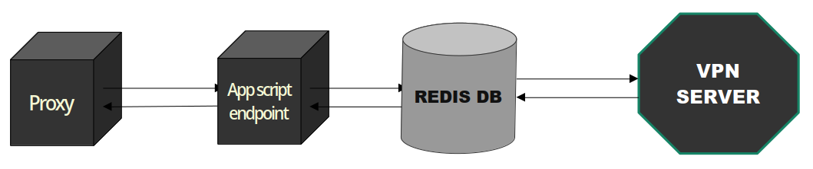

# Streaming over HTTP1 PROXY

# Explanation
This SOCKS5 proxy gathers your clients chunks every 0.5 second and batch them all in one request to google app script endpoint
It has n listeners with 6minute timeout that are waiting for response batch from redis database (they all perform redis LPOP with timeouts)
Every listener has its own redis database, for using it for a day without getting rate limited according to google documentation we can have 20000
Fetch calls a day
All of requests we use (for client chunks and vpn server chunks) are SNI requests

### Some math
for sending chunks if we say each 0.5 second sends a batch then each second send 2 batch, then for each hour we use 2*3600 = 7200 fetch calls
same happens for listeners so 14400 api calls needed at all for a hour
14400*24/20000 = 17.28, so u need 18 google accounts for 24 browsing which is not really possible because VPN SERVER restarts, i cant seriallize sockets, if u increase the number of listeners (number of google appscript endpoints) u will allocate more memory in program but, you may (most of the time as i tested) reduce the elements(batchs) in each redis list that each listener carry on, which means u will process things faster, how many databases? well free upstash dbs have a 500000 command usage limit, how many rest commands we use? i dont know ;/, it really depends on the destination and infrastructure u run the receiver.ts on it, if its VPN SERVER, well VPN SERVER adds a visibile timeout for each calls in a stream, as i saw for a https communication it may put that big timeout (it can be 2 or 5s or more or less) during handshake or tls middle, in receiver we put a 500ms timeout after each chunk arrives from the destination, if another chunk arrives we reset the timeout, if it takes more than 500ms, WE USE UPSTASH REDIS CALL here, rpushing to the list, well because of this i explained i really dont know how much databases we should get, its free make more accounts get more, their limits get reset each month

# TODO
1. If project gets some attention i will change the bandwidth and intervals with rtt measurements
2. Make logs better
3. Fixing bugs
4. Copy gstatic ip list that MasterHttpRelayVPN tested them and use them because why i should gather my list (there [ips](https://www.gstatic.com/ipranges/goog.json))

# Known Issues
Udp is kinda broken, i couldn't test it better, but some udp chunks could get transfered successfully but others couldn't because vpn server didn't support Ipv6 and some destinations didnt work (Im talking about this workflows)

# Why i made this?
I got inspired by [MasterHttpRelayVPN](https://github.com/masterking32/MasterHttpRelayVPN) its using SNI for fetching requests 
I first made a vpn with just redis db as a message bus but i needed to pay money for buying a database, so i decided to pay
Nothing and made this, I made this shit alone definetly its buggy, If you're interested u can help me with contributing in this project,
This project is useful when Internet in Iran is whitelisted again and google is open and you need tcp tunneling (udp should work but i need proper infrastructure and proper links for testing that too, its possible protocol is implemented correctly but ipv6 and many other destinations arent working in VPN SERVER)
NO FUCKING AI IS USED THERE

# FA 
سگ وحشی